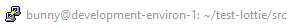

.. _GCP: https://cloud.google.com/free
.. _console: https://console.cloud.google.com/
.. _SDK: https://cloud.google.com/sdk/

Set Up a Ubuntu Environment on GCP
==================================

1. Ubuntu VM Setup
-------------------

.. topic:: 1.1 Create a Virtual Machine (VM)

    Assuming you have signed up to GCP_ and that you are signed in via the console_, create a new project with a unique name. This demo will use:

    .. code-block:: bash
    
        lottie-1010

    .. warning:: You may use an existing project, however this demo is setup for the novice. Deviate and adjust to your needs.
 

.. topic:: 1.2 Set up a VM from the CLI

    Download the software development kit (SDK_). Open this up and you will have a CLI (command line interface) with which you can interact with GCP. 

.. note:: Copy/Pasting text into a terminal

    Once you have code copied, you right click with your mouse and the paste executes.

    Now switch to this project using your project id, for this example that means:

.. code-block:: bash

        gcloud config set project lottie-1010

Then you can initiate and provision a VM using the following code:

.. code-block:: bash

    gcloud compute --project=lottie-1010 instances create development-environ-1 --zone=us-central1-a --machine-type=n1-standard-1 --subnet=default --network-tier=PREMIUM --maintenance-policy=MIGRATE --service-account=123338807608-compute@developer.gserviceaccount.com --scopes=https://www.googleapis.com/auth/devstorage.read_only,https://www.googleapis.com/auth/logging.write,https://www.googleapis.com/auth/monitoring.write,https://www.googleapis.com/auth/servicecontrol,https://www.googleapis.com/auth/service.management.readonly,https://www.googleapis.com/auth/trace.append --tags=http-server --image=ubuntu-1604-xenial-v20200317 --image-project=ubuntu-os-cloud --boot-disk-size=10GB --boot-disk-type=pd-standard --boot-disk-device-name=development-environ-1 --no-shielded-secure-boot --shielded-vtpm --shielded-integrity-monitoring --reservation-affinity=any
    gcloud compute --project=lottie-1010 firewall-rules create default-allow-http --direction=INGRESS --priority=1000 --network=default --action=ALLOW --rules=tcp:3000 --source-ranges=0.0.0.0/0

.. Note::

    If you are warned that you have chosen a small disc size, don't worry! Press return and continue.

.. Note:: There is a very simple-to-use form-interface to set up the VM as an alternative to the CLI.

    hamburger > Compute Engine > VM instances

    If you delete this machine and start again, you will find that the firewall rules you set up are retained. Therefore, this interface is the place to go to edit the VM's settings and attach firewall rules such as default-allow-http.

.. topic:: 1.3 SH into your VM

    You can SSH from the GCP console_, but for brevity we will continue to use the CLI. Which means using the following:

    .. code-block:: bash

        gcloud compute ssh --project lottie-1010 --zone us-central1-a development-environ-1

    This will open up a new window which is the SSH terminal communicating directly with your VM.

    .. image:: ../images/SSH.PNG

2.0 Set Up Your Development Environment
----------------------------------------

NB we are going to use the terminal connection to your cloud machine. Don't get this confused with other black screens you have open, such as the SDK! Luckily, there is a visual hint that you are using a tunnel:

.. topic:: 1.4 Use this SSH connection to interact with your VM.

    Update this VM's environment with:

    .. code-block:: bash
    
        sudo apt-get update

.. topic:: 1.5 Install Node.js (which will also give you npm).

    .. code-block:: bash
    
        curl -sL https://deb.nodesource.com/setup_12.x | sudo -E bash -
        sudo apt-get install -y nodejs

.. topic:: 1.6 Update npm

    .. code-block:: bash

        sudo npm install npm@latest -g
 

.. topic:: 1.7 Install React

    .. code-block:: bash

        sudo npm install -g create-react-app

 
.. topic:: 1.8 Create our own React app

    .. code-block::

        sudo create-react-app test-lottie

.. topic::1.9 Navigate and Start your App

    Enter the folder containing the app and start the server using:

    .. code-block::bash

        cd test-lottie
        npm start

.. topic:: 2.0 Serve the React App

    Now you are ready to start your app using:

    .. code-block::

        npm start

    test-lottie is now available for viewing, your dev environment will display something like this:

    .. image:: ../images/test-lottie-links.PNG

    NB neither of these suggested options are easy to use, as we have not installed a browser on our little VM. Rather, go to the GCP console and grab the external IP address for your VM. Add :3000 to the end of this and refresh the page.

.. note:: 

    To locate your External IP navigate:

    GCP > Compute Engine > VM instances > External IP

You should be able to see the base React App.

    .. image:: ../images/base-react.PNG

.. topic:: 2.1 Stop the React App

    We will want to add our lottie files to this app, so stop the server using: 

    .. code-block::bash

        Ctrl C

3.0 Upload your Lottie to your VM
==================================

.. topic:: Upload a local file to your VM:

    1.1. Return to the SDK window and enter the following to create the bucket:

    .. code-block::bash

        gsutil mb -p lottie1010 on gs://lottiefile/ 

    1.2 From the CLI use the following (adapted to your file location):

    .. code-block::bash

        gsutil cp [OBJECT_LOCATION] gs://lottiefile/

    .. note:: The GCP interface provides a file picker.

    Navigate to the GCP console > Storage > Browser > lottiefile > Upload files and use their file picker.

    5.3 Copy this file onto your VM. Return to your SSH connection and run the following:

    .. code-block::bash

        sudo gsutil cp gs://lottiefile/lottie.json src

        sudo gsutil cp gs://lottiefile/lottie.json bunny/test-lottie/src

// this does not put the file in the right spot- try again!

//into the src directory and edit App.js and App.css files. from within nano
//you use Ctrl + O to save and Ctrl + X to exit.cd

===================================
Modify your React App with a Lottie
===================================

By setting up in a cloud environment you can follow along using the same development environment as this demo. For this first follow the `Set Up a Common Environment on GCP`_, if you already have a React app set up in your own environment, then continue.

Customize Your App with a Lottie
=================================

.. topic:: Get your Lottie code in place.

    With a base React App set up, we are ready to modify it. As the landing page for React helpfully tells us, this means editing the App.js file.

    1. Go grab your favorite Lottie from the `Lottie library <https://lottiefiles.com/>`_

    This means signing up using your chosen method and then browsing the available options. The world can always use a little extra love, so we have chosen the `kiss of the heart <https://lottiefiles.com/18304-kiss-of-the-heart>`_. Download this and rename it to lottie.JSON for this demo.

.. topic:: Modify your React Appp

    2. Go grab the Lottie library for React using:

        // Does the user need to be at the test-lottie folder to do this or is this a global install?

        .. code-block::bash

         sudo npm install --save react-lottie

        .. note:: LottieFiles has produced a webplayer for Lotties, so you don't have to upload the JSON, but can rather reference the code. This demo, however, includes the upload of code to assist the novice with using their VM.

    3. Open the App.js file with the nano editor.

        .. code-block::bash

            sudo nano App.js

        Now we can see some of the inners of our React app. 

            .. note::

                Nano is a neat little text editor.
                Make the edit.
                Crtl 0 writes the change
                Return accepts the offered filename, overwriting the original
                Ctrl X closes the nanocd ..

    5. Edit your App.js file to include a call to the Lottie library

        Use your SSH connection to the VM to edit App.js using nano:

            .. code-block::bash

                sudo nano App.js

         Then, at the end of the import list add:

            ..code-block::
   
                import Lottie from 'react-lottie';

            .. image:: ../images/modifyAppCall.PNG 

            Set the variable that will be called:

            ..code-block::

                let animObj = null;

        Now, ask for your Lottie

class App extends React.Component {
  componentDidMount() {
    console.log('componentDidMount');
    
    //call the loadAnimation to start the animation
    animObj = lottie.loadAnimation({
    container: this.animBox, // the dom element that will contain the animation
    renderer: 'svg',
    loop: true,
    autoplay: true,
    animationData: animationData // the path to the animation json});

.. warning::

    Nano requires a CTL + O to save your changes
    Return will accept the suggested file name (and overwrite)
    CTL + X exits nano

.. code-block:: 

    import Lottie from 'react-lottie';

    import animationData from './lotties/kiss-of-the-heart';

This worked in Sandbox

.. code-block:: javascript

export default class LottieControl extends React.Component {

  render() {
    const defaultOptions = {
      loop: true,
      autoplay: true,
      animationData: animationData,
      rendererSettings: {
        preserveAspectRatio: 'xMidYMid slice'
      }
    };

    return 

      <Lottie options={defaultOptions}
              height={400}
              width={400}/>
    

    }
    }

